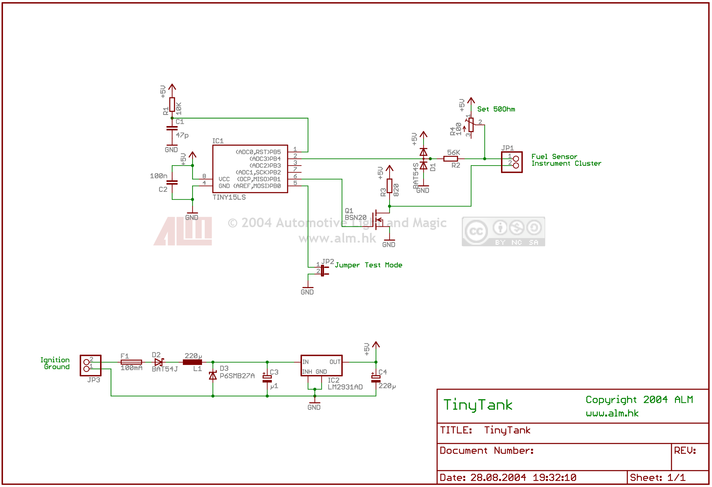

Fuel Level Sensor - TinyTank
============================

Many Audi type 89 or B4 enthusiasts want to replace their instrument cluster by a more modern one from an A4 (B5) or A6 (C5). Mechanically these clusters fit almost perfectly. Electronically there are some problems to deal with. One is the different characteristics of the fuel level sensors. A type 89 sensor has a logarithmic scale. Newer ones are linear scaled.  
  

  
Replacing the fuel sensor results in an imprecise gauge. Changing the lookup table inside the instruments cluster's firmware isn't feasible for everybody. So a good compromise is keeping the original sensor and adapting its signal to the needs of the instrument cluster.  
  

  
Using Atmel's ATtiny15 TinyTank measures the fuel level via the ADC and produces a PWM signal to the instrument cluster. TinyTank needs only be connected to ground, ignition and the fuel level sensor. A jumper is provided to bring up a test mode. Normally this jumper should be left open. By shortening to ground and switching on ignition the fuel gauge should travel from empty to full and reverse as long as ignition stays high.  
  

Downloads
---------

**Content**

**License**

[Schematic and Demo Board](downloads/TinyTankSchematic.zip) ¹, ²

  

[Source code](downloads/TinyTank.zip)

  

[Intel HEX File](downloads/TinyTank.hex) ³

  

³ Internal oscillator calibration set to 0x78 
